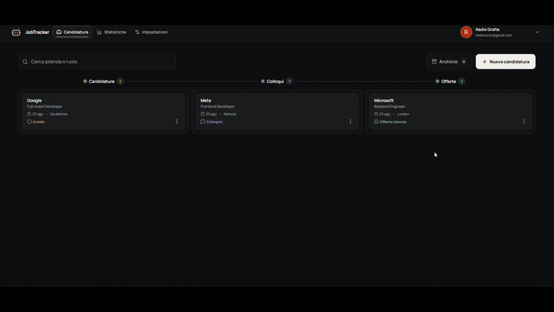
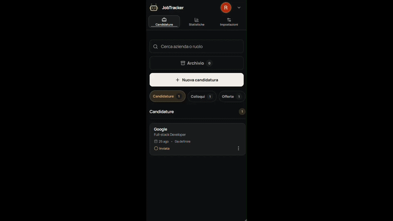

# JobTracker

**A private, responsive workspace for managing job applications from first submission to the job offer with an active pipeline, reliable status history and job-search insights.**

[**Live Demo →**](https://job-tracker-navy-gamma.vercel.app/)

**Next.js 16 · React 19 · TypeScript · Kotlin · Ktor · MongoDB · Auth0**

> The live demo requires registration through OAuth and does not use a shared demo account. Each user gets a private workspace. The interface is currently in Italian.

<!--
HERO GIF PLACEHOLDER — docs/jobtracker-overview.gif

Goal: show the value of the product in 12–15 seconds, without requiring a recruiter to sign in.
Record at 1440×900 or a similar 16:10 desktop resolution.

Sequence:
1. Start on a populated dashboard with all three active stages visible.
2. Create a new application with only the essential fields.
3. Drag it from Applied to Interview.
4. Open its inspector to reveal the timeline and available actions.
5. End on the statistics page for about two seconds.

Use fictional data, keep the pointer moving deliberately and remove loading or idle time.
When ready, replace this comment with:

-->



JobTracker brings applications, notes, status changes and search insights into one focused workspace. I built it to replace the spreadsheets and scattered notes I was using during my own job search, and I now actively use it to manage that process.

The project also became a way to move beyond frontend-only development and take ownership of an authenticated product end to end: interaction design, client state, API boundaries, business rules, persistence and deployment.

## Product highlights

### A dashboard focused on active opportunities

The main workspace presents the current hiring pipeline as a Kanban-style flow:

```text
Applied → Interview → Offer
```

Rejected and withdrawn applications remain accessible in a separate view, keeping the dashboard focused on opportunities that are still active.

Applications can be created, edited, searched and deleted, with support for company, role, application date, location, job listing, notes and current status.

### Fast, contextual interactions

On desktop, applications move between stages with drag and drop. Selecting a card opens a contextual inspector beside the board, so details, history and actions remain available without losing the pipeline view.

Status controls provide an explicit alternative to drag and drop, while optimistic updates make changes feel immediate. If a request fails, the interface restores the previous state; recent status changes can also be undone safely.

### Reliable history and useful insights

Every application keeps a chronological history of its status changes. The backend owns this history: clients request a transition, while Ktor validates it, assigns the timestamp and persists it.

That history powers both the application timeline and statistics such as:

- applications sent in the last 30 days;
- current pipeline distribution;
- applications that reached interviews or offers;
- most frequent locations;
- average time spent in the current stage, when reliable history is available.

<!--
INSIGHTS GIF PLACEHOLDER — docs/jobtracker-insights.gif

Goal: connect a status change to the information derived from it in 8–10 seconds.
Use a desktop crop focused on the relevant content rather than recording the full browser window.

Sequence:
1. Open an application inspector with at least three status transitions.
2. Pause briefly on the timeline and time-in-stage metrics.
3. Move to Statistics and show the funnel, distribution and location panels.

Use a dataset with varied stages and cities so the charts are immediately readable.
When ready, replace this comment with:

-->

### A responsive experience, not a shrunken desktop

The mobile interface switches to a focused single-stage view. Application details become a full-screen experience, and status changes use touch-friendly controls instead of depending on desktop drag and drop.

Theme, information density and motion preferences can be adapted to the user and are stored locally on the device.

<!--
MOBILE GIF PLACEHOLDER — docs/jobtracker-mobile.gif

Goal: demonstrate that mobile uses a deliberate interaction model in 8–10 seconds.
Record at 390×844 or a comparable phone viewport.

Sequence:
1. Switch between the Applied, Interview and Offer filters.
2. Open an application in the full-screen detail view.
3. Change its status using the mobile action controls.
4. Return to the list and show the updated count.

Avoid reproducing the desktop GIF shot for shot; emphasize the mobile-specific flow.
When ready, replace this comment with:

-->



## Architecture

JobTracker is split into a Next.js frontend and a separate Kotlin/Ktor REST API.

```text
Browser
   │
   ▼
┌──────────────────────────────────┐
│ Next.js                          │
│                                  │
│ • App Router                     │
│ • Server Components              │
│ • Auth0 session                  │
│ • Same-origin API proxy / BFF    │
└────────────────┬─────────────────┘
                 │ Bearer JWT
                 ▼
┌──────────────────────────────────┐
│ Kotlin / Ktor REST API           │
│                                  │
│ • Authentication                 │
│ • Validation                     │
│ • Business logic                 │
│ • Per-user data isolation        │
│ • Status history                 │
└────────────────┬─────────────────┘
                 │
                 ▼
           ┌───────────┐
           │ MongoDB   │
           └───────────┘
```

The browser communicates with same-origin Next.js API routes rather than calling Ktor directly. Next.js retrieves the Auth0 access token server-side and forwards authenticated requests to the API.

Ktor validates the JWT, derives the user identity from its claims and scopes every MongoDB operation to that identity.

## Key engineering decisions

### Next.js as a Backend for Frontend

Next.js acts as a small **Backend for Frontend (BFF)** between the browser and Ktor. Authentication remains at the server boundary, client components use a same-origin API, and the frontend does not depend on the physical location of the backend service.

### Server-owned status history

The frontend cannot write or rewrite `statusHistory`. Ktor creates a transition only when the status actually changes and assigns its timestamp on the server. This makes the timeline a dependable source for derived statistics.

### Per-user data isolation

The backend never trusts a user identifier supplied by the client. Ownership comes from the authenticated JWT, and repository operations always combine the requested resource with that identity.

### Responsive interaction patterns

Desktop and mobile share the same product model but use controls suited to their context: drag and drop with an adjacent inspector on larger screens, explicit stage filters and a full-page detail flow on mobile.

## Tech stack

| Area           | Technologies                     |
| -------------- | -------------------------------- |
| Frontend       | Next.js 16, React 19, TypeScript |
| Backend        | Kotlin, Ktor                     |
| Database       | MongoDB                          |
| Authentication | Auth0, JWT                       |
| Interaction    | dnd-kit                          |
| Icons          | Lucide                           |
| CI             | GitHub Actions                   |
| Web deployment | Vercel                           |

## Project structure

```text
.
├── frontend/
│   └── src/
│       ├── app/          # Routes and server boundaries
│       ├── components/   # Shared interface components
│       ├── features/     # Product-specific modules
│       ├── lib/          # Authentication and shared utilities
│       └── styles/       # Global styles and design tokens
└── src/
    ├── main/kotlin/
    │   ├── config/       # Environment and infrastructure setup
    │   ├── dto/          # API request models
    │   ├── model/        # Domain models
    │   ├── repository/   # Persistence boundaries
    │   ├── routes/       # HTTP endpoints
    │   ├── service/      # Application rules
    │   └── validation/   # Request validation
    └── test/kotlin/      # Backend tests
```

The backend keeps HTTP handling, application rules and persistence separate. On the frontend, most product code lives in feature modules while routing and server boundaries remain inside the App Router.

## Quality checks

The project includes a small, targeted automated test suite rather than broad coverage.

- Backend tests cover unauthenticated access, request validation, status-history rules, ownership isolation and safe status undo.
- Frontend tests cover statistics edge cases and preference parsing.
- GitHub Actions checks the frontend lint and production build and verifies that the backend assembles successfully on pushes and pull requests to `main`.

## Project status

JobTracker is a working product that I actively use for my own job search. It is still evolving as I encounter new needs and refine the dashboard, responsive interactions and the insights derived from application history.

## Why I built it

My job search was spread across spreadsheets, notes and browser bookmarks. I wanted one place where I could see what was still active, remember the context behind each application and understand how the search was progressing.

At the same time, I wanted a project that would push me beyond my usual frontend comfort zone. Building JobTracker meant following an authenticated request through the entire system, from responsive UI state and optimistic feedback to JWT validation, backend business rules and MongoDB persistence.

The result is a tool I rely on while looking for my next role, and a product I can continue improving through real use.
